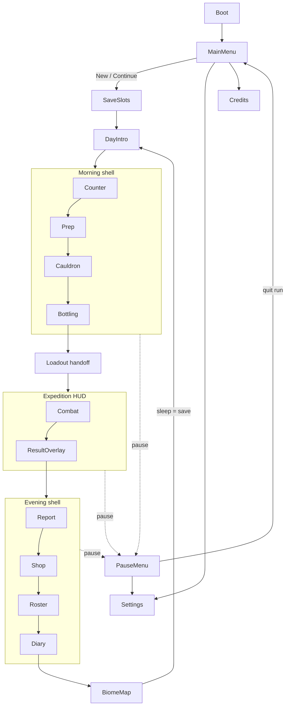

# Alchemist's Arsenal — Game & UI/UX Design

> **Version:** 0.4 (post reviewer rounds 1–3 — see `DESIGN_REVIEW_LOG.md`)
> **Scope:** the whole game. This document is the single source of truth for
> *what the game is*, *every screen it has*, *how those screens bind to the
> existing C# systems*, and *the visual language* they are all drawn in.
> It deliberately keeps the richer implemented systems (5 elements, boss HFSM,
> IAUS) rather than the simpler pitch/GDD idealisation — per project direction.
>
> **Tags:** `[floor]` = rubric-load-bearing, must exist for a Level-2 score ·
> `[deepening]` = quality/scope beyond the floor, cut first if time is short.
> The build order (`ROADMAP.md`) ships the whole `[floor]` set as one thin
> vertical slice **before** deepening anything.

---

## 0. One-paragraph pitch

You play a witch running a potion shop on the edge of a cursed forest. Each **day**
has three phases: **Morning** you race the clock across four crafting stations to
brew elemental bombs; **Afternoon** those exact bombs arm hired adventurers who
auto-battle through one of five elemental biomes; **Evening** you spend the loot on
shop upgrades and adventurers, and read the visual diary that unravels why you
cursed someone you love. Craft quality (0–100) is the spine: it directly scales
afternoon damage, payout, and elemental effectiveness.

---

## 1. Core loop & pillars

```
        ┌──────────── DAY N ────────────┐
        │                               │
  MORNING (shop)  ──►  AFTERNOON (expedition)  ──►  EVENING (management + story)
  4 stations,          auto-battler, 1 biome,       report → shop → roster → diary
  beat the clock       your potions = the ammo      → sleep (save) → DAY N+1
        │                               │
        └────────── quality 0–100 is the through-line ──────────┘
```

**Design pillars**
1. **The craft *is* the build.** Every morning decision is legible in the afternoon fight. No abstract "score" — you watch your sloppy Okay-grade Firebloom do visibly less.
2. **Frantic hands, calm mind.** Morning is twitchy (stir, chop, time the dryer). Afternoon is spectator-strategic (you set it up, then read it). Evening is quiet.
3. **Everything is drawn.** All art is self-made pixel art. The story is never a text wall — it assembles visually in the diary.
4. **Readable systems.** The AI, the elemental matrix, and the quality bands are surfaced in the UI, not hidden. A curious player can open the reasoning inspector and see *why* the adventurer threw water.

### 1.1 Idea: hiring & raising heroes `[idea]`

> **Status: concept only.** Not implemented and not scheduled in `ROADMAP.md`.
> It describes where the game wants to go; the details are expected to change.

**Core idea.** Adventurers aren't interchangeable carriers for your potions.
They're people you *choose* and *grow*. **Your potions + their skills = the fight.**

**Hiring**
- Candidates answer a **notice board** at the shop. The pool changes over time,
  so not everyone is available every day.
- Each candidate brings:
  - a **personality**, which shapes how they behave in a fight and how they react
    to your potions;
  - a **fighting style**, for example charging in, keeping their distance, or
    throwing fast;
  - a **price**: a hiring fee, a wage, or a share of the loot.
- Example archetypes:
  - **Brave:** charges in and loves strong, simple brews.
  - **Careful:** keeps their distance and makes every flask count.
  - **Greedy:** cheap to hire, but wants a cut of the loot.
- The tension: your budget vs. who suits tomorrow's road vs. which potions you
  can actually brew well for them.

**Raising (development)**
- **Experience:** every expedition teaches them something, and heroes grow from
  *rookie* to *veteran*.
- **Traits:** at milestones the player picks perks that change how a hero fights,
  for example throwing further, getting more out of one element, or carrying an
  extra flask.
- **Loyalty:** arming a hero well (good quality, the right element) builds
  loyalty. Repeatedly sending them out with poor potions wears it down. A hero
  with low loyalty may ask for more pay, refuse a road, or walk away.

**How it ties into the loop**
- **Morning:** *who* you're brewing for matters, because a hero's style favours
  certain potions.
- **Afternoon:** the fight reads as potion quality × hero skill.
- **Evening:** hire, train, pick traits, and choose tomorrow's party (the Roster
  tab, §7.9.3).
- **Story:** heroes could carry personal threads into the diary (open).

**Open questions**
1. Cost model: a one-off fee, a daily wage, a loot share, or a different one per
   archetype?
2. How many heroes can you keep on the roster, and how many go out at once?
3. Can a hero be lost for good, or only injured and forced to rest?
4. Do traits come from a fixed path per archetype, or a random pick of three?
5. Does loyalty change combat behaviour directly, or only pay and availability?

---

## 2. Canonical rules (authoritative — code matches this, not the GDD)

### 2.1 Elements
`ElementType { Nature=0, Fire=1, Water=2, Poison=3, Arcane=4 }` (fixed order — matrix indexes it).

Effectiveness wheel (attacker ► defender = ×2; reverse = ×0.5):
- **Fire ► Nature ► Water ► Fire** (rock-paper-scissors core)
- **Poison ► Nature** (secondary)
- **Arcane ► Poison** (boss-tier)
- Everything else ×1.

### 2.2 Quality → combat (the `CombatQuality` contract)
| Band | Score | Damage | Payment | Elemental bonus | Extra |
|---|---|---|---|---|---|
| **Perfect** | 95–100 | ×1.20 | ×1.00 | on | + gold tip |
| **Great** | 80–94 | ×1.00 | ×1.00 | on | — |
| **Okay** | 60–79 | ×0.75 | ×0.70 | on | — |
| **Poor** | < 60 | ×0.50 | ×0.40 | **off** | — |

> **Resolved (reviewer round 3):** `Systems.QualityTier` (an older 3-band enum)
> is **deleted** — ROADMAP 0.14. Everything the player sees is the 4-band
> `CombatQuality`. Note the score still *starts high and decays* (the rubric's
> novel mechanic) — the change in §7.6.1 is only that an *untouched* order starts
> at 25, not 100.

### 2.3 The five biomes (`BiomeData`)
| # | Biome | Theme element | Role | Boss |
|---|---|---|---|---|
| 1 | Whispering Woods | Nature | Tutorial | — |
| 2 | Cinder Peaks | Fire | — | — |
| 3 | Frostbite Caverns | Water | — | — |
| 4 | Venom Swamp | Poison | — | — |
| 5 | The Coven's Peak | Arcane | Finale | **The Coven Matriarch** (HP 520, HFSM: Neutral / Enraged / ElementalWard / Recovering) |

Each biome = warm-up → N monster waves → optional boss → win/lose (`ExpeditionManager`).

### 2.4 Day phases
`Morning → Afternoon → Evening → (save) → next day`. Currently there is **no orchestrator**
tying these together (see gaps). Design introduces `GameLoopManager` owning
`GamePhase { Boot, MainMenu, Morning, Afternoon, Evening, DayTransition }`.

### 2.5 Time model (authoritative — resolves reviewer C2)
One rule, everywhere:
- **The morning budget is real wall-clock time** — it drains on
  `Time.unscaledDeltaTime` and is **never** implemented with `Time.timeScale`.
- **Tutorial "slow motion" is not slow motion.** Day 1 sets
  `GameLoopManager.budgetRateMultiplier = 0.35` — the *budget drains slower*.
  The simulation (cauldron physics, timers) always runs at real speed.
- **`Time.timeScale` has exactly one owner: `TimeControl`** (a Phase-1 service).
  Only two things push requests onto it: expedition **speed** (1× / 2×) and
  **pause** (0×). `TimeControl` keeps a stack and restores the previous value on
  release, so "pause during 2×" resumes at 2×. Nothing else — not the tutorial,
  not the morning — ever writes `Time.timeScale`.
- Physics code that divides by `Time.deltaTime` (e.g. cauldron mouse velocity)
  is therefore only ever affected by expedition speed, which is fine (the
  cauldron isn't active then).

---

## 3. Existing systems the UI binds to (do not re-implement)

| System | Key surface for UI | Notes |
|---|---|---|
| `Systems.StationManager` (singleton FSM) | `CurrentStation`, `TrySwitchStation()`, events `OnStationChanged`, `OnStationEntered/Exited`, `OnLockStateChanged`, `IsStationUnlocked()`, `SetStationLocked()`, `StationSet` | Pure nav state. Tutorial locks stations through it. |
| `Systems.CraftingManager` (singleton) | `CurrentOrder` (`ActiveOrder`), events `OnOrderStarted/Completed`, `OnTimerChanged` | `ActiveOrder` holds `qualityScore` 0–100, `deductions[]` (station + reason + points), `OnQualityChanged`. |
| `Crafting.PhysicsCauldronManager` (singleton) | `Heat01`, `MinOptimalHeat`, `MaxOptimalHeat`, `OnHeatChanged`, `SetHeat()`, `PhysicsStepCount` | Simulation runs in `FixedUpdate`; **must not be parented under a tab panel** (SetActive(false) freezes it — `StationUIManager.OnValidate` already warns). |
| `Systems.StationSet` / `Data.StationDefinition` | `DisplayName`, `TabIcon`, `TutorialHint`, `UnlockedByDefault` | Decoupled per-station presentation. |
| `Combat.ExpeditionManager` | `Phase` (`Warmup/Waves/BossFight/Won/Lost`), `WaveNumber`, `TotalWaves`, `BossInstance`, events `OnPhaseChanged`, `OnWaveStarted`, `OnFinished(bool won)` | One run per afternoon. |
| `Combat.UtilityAI_CombatController` | `LastBreakdown` (`IReadOnlyList<ScoredCandidate>`), event `OnBombThrowRequested` | The reasoning inspector reads `LastBreakdown`. |
| `Combat.BossPhaseManager` | `CurrentPhase` | Drives boss health-bar phase pips. |
| `Combat.CombatantBody` | `CurrentHP`, `MaxHP`, `IsAlive` | Portraits + boss bar. |
| `Combat.MonsterRegistry` / `AdventurerRegistry` (`CombatRoster`) | `ActiveMonsters`, `ActiveAdventurers` | Live counts for HUD. |
| `Combat.CombatQuality` (static) | `GradeFor(int)`, `DamageMultiplier`, `PaymentMultiplier`, `GoldTip` | Single source of grade math — UI calls it, never re-derives. |
| `Data.ElementalMatrix` | `GetMultiplier(atk, def)` | Counter screen's "elemental need" hint + damage-number colouring. |

**New runtime pieces** — kept deliberately small (reviewer C-R2a). **6
MonoBehaviour managers**; everything else is data or pure logic:

| Manager (singleton) | Owns |
|---|---|
| `GameLoopManager` | `GamePhase`, morning budget (§2.5), scene load/unload (§11), `BeginAfternoon/Evening/AdvanceDay` |
| `SaveSystem` | the single **`RunState`** (day, gold, biomeIndex, owned herbs/upgrades/adventurers, best grades, unlocked diary, `tutorialCompleted`) + JSON persistence (§9) |
| `AudioManager` | mixer groups, music beds, SFX, Animalese synth |
| `UIManager` | screen router — one canvas, screen roots toggled |
| `TimeControl` | sole `Time.timeScale` owner (§2.5) |
| `TutorialManager` | the Day-1 FSM |

**Pure logic (plain / static — no lifetime):** `Forecast` (day's `BiomeData.
Waves` → elemental demand), `LoadoutBuilder` (`ActiveOrder` → a **fresh runtime**
`AdventurerLoadout` — never writes the SO, matching how `UtilityAI_Combat
Controller` already treats the asset), `ExpeditionReport` + its
`ExpeditionTelemetry` listener, `Economy` (grade → payout via `CombatQuality`),
`DiaryUnlockEval`.
Earlier drafts' `InventoryManager` / `RosterManager` / `UpgradeManager` /
`ProgressionManager` are **folded into `RunState` fields + these helpers.**

**Pre-existing singletons (keep — not part of the 6):** `StationManager` and
`CraftingManager` are already `DontDestroyOnLoad` and null their `Instance` on
destroy → they live in `Core.unity` (§11). `PhysicsCauldronManager` is a
scene-scoped singleton → it lives in `Shop.unity` and **needs an `OnDestroy` that
nulls `Instance`** so an additive scene reload can't leave `CauldronUI` bound to
a dead manager (reviewer X5).

---

## 4. Current UI state (why we are remaking it)

- **1 scene** (`SampleScene`, default), **0 prefabs**, **0 sprites**. Placeholder
  discs/diamonds baked at runtime by `PlaceholderArt`.
- **2 UI scripts only:** `StationUIManager` (tab nav — but the panels it toggles
  do not exist) and `CauldronUI` (heat slider + quality text — references unwired).
- **Expedition "HUD" = `OnGUI()` debug labels** in `ExpeditionBootstrap`.
- No main menu, pause, settings, save UI, evening phase, diary, shop, roster,
  biome map, tutorial overlay, results screen, toasts.

**Verdict:** the UI is effectively greenfield. We design it whole, in one
consistent language, and build it against the router below.

---

## 5. Visual language

### 5.1 Rendering & resolution
- **Unity uGUI** (`Canvas`, Screen-Space Camera) + **TextMeshPro**. Matches existing
  code and `AGENTS.md` (`@UIAgent` works in `UnityEngine.UI`). No UI Toolkit.
- `CanvasScaler`: *Scale With Screen Size*, reference **1920×1080**, match **0.5**.
- World: **Pixel Perfect Camera**, assets authored at **PPU 32**, point filter, no
  compression, no mip. Virtual world pixel grid ≈ **480×270** (×4 → 1080p).
- Target 1920×1080 / 16:9, windowed + fullscreen, min supported 1280×720.

### 5.2 Palette
Cottage / UI chrome (warm, candlelit):
| Token | Hex | Use |
|---|---|---|
| `ink-900` | `#1b141f` | deepest background |
| `ink-800` | `#241a2b` | panel back |
| `ink-700` | `#33263c` | raised panel |
| `parchment` | `#efe2c4` | primary text, ticket paper |
| `parchment-dim` | `#c9b892` | secondary text |
| `wood` | `#6b4a2f` | frames, station rail |
| `wood-dark` | `#3f2c1c` | frame shadow line |
| `candle` | `#e8b64c` | primary accent, gold, CTA |
| `candle-hot` | `#f6d873` | hover/glow |
| `witch` | `#7b4d9e` | brand purple, magic FX |
| `danger` | `#d64550` | defeat, overheating, destructive |
| `ok` | `#4fae5a` | green zone, success |

Element colours (identical everywhere — bomb, tab, monster tint, biome wash, damage number):
| Element | Hex | Colourblind shape |
|---|---|---|
| Nature | `#5ea637` | circle / leaf |
| Fire | `#e2683a` | upward triangle |
| Water | `#3f8fd0` | droplet |
| Poison | `#b6c33f` | hexagon |
| Arcane | `#c451a8` | four-point star |

> **Rule:** element identity is **always** colour **+ shape**. No UI communicates
> element by hue alone (colourblind support is a Usability rubric concern).

### 5.3 Typography
- **Display / headings:** a chunky pixel face (e.g. an open-license face like
  *m6x11* or a self-made one — asset task). All-caps for section headers.
- **Body / numbers:** a legible small pixel face (e.g. *Pixellari* / self-made).
  Numbers tabular so meters don't jitter.
- Sizes on the 1920×1080 canvas: H1 48, H2 32, H3 24, body 20, caption 16. Never
  below 16. Line-height 1.4. Text has a 2px hard drop shadow (`ink-900`) for
  contrast over busy scenes.

### 5.4 Layout & shape
- **8px spacing base** (8/16/24/32/48/64).
- **Hard corners, 2px borders.** Panels are 9-slice pixel frames (`wood` border,
  `ink-800` fill, 1px inner `wood-dark` bevel line).
- Safe margin 48px from screen edge for HUD-critical info.
- Z-order: world → world-space combat overlays → screen HUD → toasts → modals →
  tutorial spotlight → cursor.

### 5.5 Motion
- Eases 90–150ms, `OutQuad` default. UI never blocks on animation > 250ms.
- Signature motions: **diary page-turn** (280ms, curl), **detonation kick**
  (6px screen shake 120ms + element flash), **tab slide** (110ms), **toast**
  (slide-up + 3s dwell + fade), **quality tick** (meter fill lerps, band
  crossings pulse), **squash/stretch** on herb drop and bottle seal.
- Global **Reduce Motion** setting kills shake + parallax, halves durations.

### 5.6 Audio-visual pairing (Sound rubric hooks)
Every UI event names an `AudioManager` cue: `ui.tab`, `ui.confirm`, `ui.deny`,
`craft.chop`, `craft.dry.ding`, `cauldron.bubble` (loop, pitch tracks heat),
`bottle.seal`, `expedition.throw`, `expedition.detonate.<element>`,
`boss.phase.<phase>`, `diary.pageturn`, `evening.coin`. Adventurers/monsters emit
**Animalese** speech bubbles (pitch-shifted vowel synthesis) on order, complaint,
victory, death.

---

## 6. Screen router

`UIManager.Show(ScreenId)` — one persistent UI canvas, screens are child roots
toggled with `SetActive` (never destroyed). Gameplay simulation objects live
**outside** screen roots.



`ScreenId`: `Boot, MainMenu, Settings, Credits, SaveSlots, DayIntro, Morning,
Handoff, Afternoon, Evening, BiomeMap, PauseMenu`. Morning/Evening are shells
with internal sub-tabs; Afternoon overlays `ResultOverlay`; Tutorial is a
**layer** rendered on top of Morning, not a screen.

---

## 7. Screen specifications

Each spec: **purpose · layout · components · data binding · states · motion/audio**.

### 7.1 Boot / Splash
- **Purpose:** warm up managers, show "made with self-drawn pixel art" studio card.
- **Layout:** centred logo on `ink-900`, 1.2s, skippable on any key.
- **Binding:** `GameLoopManager` initialises singletons, `SaveSystem.ScanSlots()`.
- **Motion/audio:** logo ember-particle assemble; single `witch` chord.

### 7.2 Main Menu
- **Purpose:** entry point.
- **Layout:** left third = vertical button stack (`CONTINUE`, `NEW GAME`,
  `SETTINGS`, `CREDITS`, `QUIT`); right two-thirds = parallax cottage-interior
  art (3 layers: back wall, cauldron mid, foreground herbs), candle flicker.
- **Components:** `PixelButton` ×5, version tag caption bottom-left, animated
  cat asleep on the counter (idle loop — cheap charm).
- **Binding:** `CONTINUE` enabled iff `SaveSystem.HasAnySlot`; routes to
  `SaveSlots` (or straight into most-recent slot if only one).
- **States:** `CONTINUE` disabled + dimmed when no save.
- **Motion/audio:** parallax tracks cursor ±6px; cozy shop music bed starts here.

### 7.3 Settings
- **Purpose:** the Usability rubric's "clean options".
- **Layout:** modal-style full panel, 3 tabbed sections: **Audio · Video · Accessibility**.
  - Audio: Master / Music / SFX / Speech sliders (0–100), each with a test blip.
  - Video: resolution dropdown, fullscreen toggle, vsync, frame cap.
  - Accessibility: **Reduce Motion**, **Screen shake** toggle, **Text size**
    (S/M/L multiplier), **Colourblind element shapes** (always on, toggle just
    enlarges them), **Expedition default speed** (1× / 2×), **Hold-to-confirm**
    destructive actions.
- **Components:** `PixelSlider`, `PixelToggle`, `PixelDropdown`, `Tab` ×3, `BACK`.
- **Binding:** `SettingsService` (new, tiny) → `PlayerPrefs` + `AudioManager`
  mixer + `CanvasScaler`/`PixelPerfectCamera`. Applied live.
- **States:** "unsaved changes" is not a concept — everything applies immediately;
  `RESET TO DEFAULTS` with hold-to-confirm.

### 7.4 Save Slots
- **Purpose:** pick / start / delete a run.
- **Layout:** 3 slot cards stacked. Each card: day reached, biome node, gold,
  playtime, last-played date, mini biome-progress pips. Empty slot = "＋ New Game".
- **Components:** `SlotCard` ×3, per-card `DELETE` (hold-to-confirm),
  screenshot-style thumbnail (rendered cottage with current upgrades — stretch;
  v1 = static art + stats).
- **Binding:** `SaveSystem` (`SaveMeta[]`, `Load(slot)`, `NewGame(slot)`,
  `Delete(slot)`). JSON at `Application.persistentDataPath/slot_{n}.json`.
- **States:** empty / occupied / corrupt (card shows ⚠ + "Repair or Delete").

### 7.5 Day Intro card
- **Purpose:** frame the day, set stakes.
- **Layout:** full-bleed biome key-art with a parchment banner: "DAY 3 — CINDER
  PEAKS" + one line of flavour + today's rush modifier if any. 1.8s auto-advance,
  click to skip.
- **Binding:** `GameLoopManager.CurrentDay`, `ProgressionManager.CurrentBiome`.
- **Motion/audio:** banner unfurls; biome ambience crossfades in under the music.

### 7.6 Morning shell (persistent chrome)
- **Purpose:** container for the four stations + always-visible run status.
- **Layout:**
  - **Top bar (h 64):** day counter · gold (`ResourceCounter`, coin icon) ·
    **phase clock** (radial or bar — morning time budget draining) · today's
    target biome chip · settings cog.
  - **Left station rail (w 96):** four `TabButton`s (Counter/Prep/Cauldron/
    Bottling) top-to-bottom in flow order, each showing icon + lock state +
    a "step done" check. Active tab highlighted `candle`, locked tabs `ink-700`
    with padlock.
  - **Centre:** the active station panel (7.6.1–7.6.4).
  - **Right order dock (w 320):** the current `ActiveOrder` ticket — potion name,
    requested element badge, live `QualityMeter` (0–100, 4 band ticks), and a
    scrollable **deduction log** ("−7 Cauldron: too hot"). When the order is
    sealed at Bottling, this dock's CTA becomes **`SEND TO EXPEDITION ▶`**.
- **Components:** `TopBar`, `StationRail`, `OrderTicket`, `QualityMeter`,
  `DeductionLog`, `PhaseClock`.
- **Binding:**
  - rail ↔ `StationManager` (`OnStationChanged`, `OnLockStateChanged`,
    `IsStationUnlocked`, click → `TrySwitchStation`). This is exactly what
    `StationUIManager` already does — **keep that script**, give it real panels.
  - ticket ↔ `CraftingManager.CurrentOrder` + `ActiveOrder.OnQualityChanged`;
    labels/icons from `StationSet`/`StationDefinition`.
  - clock ↔ `GameLoopManager` morning timer (new). Tutorial slows it.
  - `SEND TO EXPEDITION` ↔ `LoadoutBuilder.Finalise()` then
    `GameLoopManager.BeginAfternoon()`.
- **Progressive station unlock (reviewer W-R2a — pacing, not just tutorial):**
  Day 1 exposes **Counter + Cauldron only** (the elemental decision + the physics
  centrepiece). **Prep unlocks Day 2**, **Bottling Day 3**, each introduced by a
  one-step tutorial beat. Uses the existing `StationManager.SetStationLocked`
  mechanism. Rationale: five new interaction models in the first three minutes is
  too much front door.
- **Every quality change is physical, in the moment (reviewer W-R2b):** a
  deduction is *never* only a log line. It fires an immediate on-screen
  consequence at its station — the brew visibly scorches/darkens when off-band,
  a mis-timed chop shatters the herb sprite, an early dryer pull leaves the herb
  green and dripping, a wrong flask cracks, an over-fill spills and stains. The
  `DeductionLog` in the order dock is a *recap*, not the player's mental model.
- **States:** normal · tutorial (budget slow, rail gated, pointer arrows) ·
  time-up (auto-advances; the order keeps whatever score it has reached — which,
  per §7.6.4, is never worse than the starting 25).
- **Architecture note:** the four centre panels are pure view. The **cauldron
  simulation GameObject is NOT inside the Cauldron panel** — it is a persistent
  world object; the Cauldron panel frames a camera/RenderTexture view of it.
  `StationUIManager.OnValidate` enforces this.

#### 7.6.1 Counter station
- **Purpose:** read the afternoon threat, decide which element to brew.
- **Layout:** split.
  - **Left — Wave Forecast:** horizontal timeline of the afternoon's waves
    (`ForecastService.Waves`): each wave a stack of monster chips (sprite +
    `ElementBadge` + count). Below it an **elemental demand bar** — normalised
    stacked bar of enemy element share, with the *counter* element called out
    ("Mostly Nature → brew **Fire**").
  - **Right — Order card:** the adventurer who placed today's order — portrait,
    class, `SpeechBubble` in **Animalese** ("Bru-nu fla-she!"), the potion they
    want, and their class trait ("Berserker: +splash").
- **Components:** `WaveForecastStrip`, `ElementDemandBar`, `MonsterChip`,
  `AdventurerOrderCard`, `SpeechBubble`.
- **Binding:** `ForecastService` (new — wraps the day's `BiomeData.Waves` +
  boss threat profile, where "the day's biome" = `ProgressionManager.
  CurrentBiomeIndex`, fixed at day start); `RosterManager.TodaysClient`;
  `ElementalMatrix` for the "brew X" recommendation.
- **Order lifecycle (resolves reviewer W1 + C-R2b + X3/X4):**
  - The day's `ActiveOrder` is created **only** on Counter confirm —
    `CraftingManager.StartNewOrder(potionName, element)` (new overload).
  - **Both existing auto-starts are removed** (reviewer X3): `Awake()` no longer
    creates an order, and `CompleteActiveOrder()` no longer starts the next one —
    it just raises `OnOrderCompleted` and clears `CurrentOrder`. A
    `bootstrapOrderForTests` flag keeps the headless sims working.
  - The order is **born at `qualityScore = 25` (Poor)** of the chosen element.
    Crafting *modifies this one order in both directions* — so `ActiveOrder`
    gains an increase path (`AdjustQuality(delta, station, reason)`) and
    `OnQualityChanged` fires on **raise and lower** (reviewer X4; today it only
    fires on `ApplyDeduction`).
  - The rubric's "quality *decays* on a 0–100 scale" framing (§2.2) still holds —
    clean brewing is how you climb back from 25 toward 100 and then *hold* it
    against decay. The born-at-25 floor just means an *untouched* order is a Poor
    potion, not a free Great one. No "fallback bomb", no "replace" step — see §7.6.4.
- **States:** not-yet-read (forecast blurred until you click "Assess") →
  assessed → order accepted (unlocks Prep in tutorial).
- **Motion/audio:** monster chips slide in staggered; `ui.confirm` on accept.

#### 7.6.2 Prep station
- **Purpose:** turn raw herbs into processed reagents — the time-management beat.
- **Layout:**
  - **Herb shelf (left):** owned `HerbData` as draggable jars (`InventoryManager`),
    each showing element badge + potency + required processing.
  - **Three work zones (centre):**
    - **Chop board** — drop herb, a `RhythmBar` sweeps; click on-beat 3× for a
      clean chop (miss = potency loss logged as a deduction).
    - **Drying rack** — drop herb, a `ProgressTimer` runs (real seconds, or
      instant with the *Instant Dryer* upgrade); pulling early = under-dried.
    - **Mortar** — hold-and-mash meter; overfill = spill.
  - **Output tray (right):** processed reagents queued for the cauldron.
- **Components:** `HerbJar`, `RhythmBar`, `ProgressTimer`, `MashMeter`,
  `ReagentTray`, drag ghost.
- **Binding:** `HerbData` SO (new), `InventoryManager.OwnedHerbs`,
  `PrepManager` (new — owns the minigame state and writes
  `ActiveOrder.ApplyDeduction` on sloppy processing), upgrades via
  `UpgradeManager`. `CraftingManager.OnTimerChanged` already exists for the
  dryer timer.
- **States:** idle · chopping · drying (n racks busy) · mashing · tray full.
- **Motion/audio:** `craft.chop` on-beat (pitch up per combo), `craft.dry.ding`
  when a rack finishes, squash on herb drop.

#### 7.6.3 Cauldron station (physics centrepiece)
- **Purpose:** the 2D-physics rubric anchor — stir with mouse velocity, hold the
  heat in the green zone.
- **Layout:**
  - **Cauldron viewport (centre, ~60% width):** framed circular window onto the
    world-space `PhysicsCauldronManager` — herbs as `Rigidbody2D` bodies swirling,
    the paddle following the cursor, liquid tint = current brew element.
  - **Heat gauge (right of viewport):** vertical `HeatGauge` 0–1 with a green
    band drawn from `MinOptimalHeat`..`MaxOptimalHeat`; needle = `Heat01`;
    status text ("TOO COLD — STIR FASTER" / "BREWING PERFECTLY" / "OVERHEATING").
  - **Reagent dock (bottom):** the Prep tray — drag reagents into the pot; each
    adds its element weighting to the brew.
  - **Brew progress ring** around the viewport; when full → "BREW COMPLETE, BOTTLE IT".
- **Components:** `CauldronViewport` (RenderTexture), `HeatGauge`,
  `BrewProgressRing`, `ReagentDock`, `StirTrail` (cursor ribbon).
- **Binding:** keep `CauldronUI` as-is. `HeatGauge` is just a **`Slider`-based
  composite** exposing exactly the four fields `CauldronUI` already serialises
  (`heatSlider`, `heatSliderFill`, `optimalRangeIndicator`,
  `temperatureStatusText`) — no new interface, no refactor (reviewer N-R2a: one
  implementer ⇒ no abstraction yet).
  Driven by `PhysicsCauldronManager.OnHeatChanged`; quality via
  `ActiveOrder.OnQualityChanged`. Stirring physics + heat decay already run in
  `Update`/`FixedUpdate` on the persistent manager (which lives in the world,
  **not** under this panel — see §11).
- **States:** cold · optimal · hot · brew-complete. Deductions tick every
  `deductionInterval` while out of band (already implemented).
- **Motion/audio:** `cauldron.bubble` loop, playback rate scales with heat;
  green-zone entry = soft chime + particle; overheat = red vignette pulse +
  `danger` sting.

#### 7.6.4 Bottling station
- **Purpose:** finalise the bomb — the last quality gate — and hand it to the adventurer.
- **Layout:**
  - **Flask carousel (left):** flask shapes (round / conical / teardrop / skull),
    some upgrade-locked. Wrong shape for the element = small deduction.
  - **Fill stage (centre):** the brew pours in; a **stop-the-meter** minigame —
    a fill line rises, click to stop; in the green fill window = clean, over = spill.
  - **Cork picker (right):** cork / wax / rune-seal; *Auto-Corker* upgrade
    auto-picks the best.
  - **Label preview:** the finished bomb — sprite, name, `ElementBadge`, final
    `CombatQuality` grade badge (Perfect/Great/Okay/Poor with band colour).
  - **`SEAL & HAND OVER`** button → the order dock CTA turns into `SEND TO EXPEDITION`.
- **Components:** `FlaskCarousel`, `FillMeter`, `CorkPicker`, `BombLabelPreview`,
  `GradeBadge`.
- **The guaranteed floor (resolves reviewer C1 + C-R2b — no special case):** the
  `ActiveOrder` was born at score 25 of the chosen element at Counter (§7.6.1).
  `LoadoutBuilder` runs **once, at `BeginAfternoon()`**, converting *the current
  `ActiveOrder`* — sealed or not — into one `BombData` (`element`; stats via
  `CombatQuality.GradeFor(qualityScore)`; ammo = how full the fill got, min 1) in
  the adventurer's `AdventurerLoadout`. Never opened Bottling → ship a score-25
  Poor potion. Sealed a great one → ship that. **Same code path, no `isSludge`
  flag, no "replace".** Report shows the grade like any other.
- **Binding:** `BottlingManager` (new, small) writes flask-match / fill
  deductions to `ActiveOrder` and fires `CraftingManager.CompleteActiveOrder()`.
  The loadout conversion is `LoadoutBuilder` (pure), invoked by `GameLoopManager`
  on the phase transition — not by Bottling.
- **States:** choosing flask · filling · corking · sealed. `[Bottling is a
  Day-3+ unlock — §7.6]`
- **Motion/audio:** `bottle.seal` thunk + wax-drip particle; grade badge stamps
  in with a squash; Perfect grade = gold sparkle + `evening.coin` tease.

### 7.7 Loadout handoff
- **Purpose:** confirm what's going into the fight before committing.
- **Layout:** the party (1–4 adventurer cards). Each card: portrait, class,
  HP, and their **bomb slots** — the potion(s) you brewed this morning shown with
  element badge + grade + ammo count. A "today you only armed 1 of 3" nudge if slots empty.
  Big **`BEGIN EXPEDITION ▶`**.
- **Components:** `PartyRoster`, `AdventurerLoadoutCard`, `BombSlotChip`.
- **Binding:** `RosterManager.ActiveParty`, `AdventurerLoadout` (from
  `LoadoutBuilder`), `AdventurerData` traits.
- **States:** ready (the floor rule means "under-armed" = "carrying only Raw
  Sludge", still shown, still allowed).
- **Party size (resolves reviewer W5):** **v1 sends exactly one adventurer.**
  `ExpeditionBootstrap`'s `adventurerCount` is set to 1 for the real game (2 is a
  test/demo convenience only). The roster unlock raises the cap; **each extra
  party slot requires its own morning craft**, and any slot the player didn't
  brew for ships that adventurer with a Raw Sludge fallback of the Counter-chosen
  element. Every screen is *laid out* to hold 4 cards; only 1 is *populated* in v1.

### 7.8 Afternoon — Expedition HUD
- **Purpose:** read the auto-battle; feel the morning's quality pay off.
- **Layout (overlay on the full-screen combat view):**
  - **Top-centre banner:** biome name + `WAVE 2 / 3`, or during boss:
    **boss name + `BossHealthBar`** with **phase pips** (Neutral/Enraged/
    Ward/Recovering, current one lit).
  - **Bottom party dock:** one `PortraitCard` per adventurer — portrait, HP bar,
    **current bomb** (element badge + grade), **ammo pips**, **cooldown radial**.
    Card desaturates + cracks on death.
  - **Top-right controls:** speed `1× / 2×`, **pause**, and a **↳ reasoning**
    toggle.
  - **Always-on AI ticker (reviewer W-R2c):** a single line above the party dock
    narrating the last decision — "Rookie → Tidevial · Water ×2 vs Bark Treant".
    Makes cat-8 / the novel loop visible to a grader without opening anything.
    `[floor]` — the full inspector below is `[deepening]`.
  - **Reasoning inspector (toggled, right side):** `[deepening]` for the selected adventurer,
    a live bar list from `UtilityAI_CombatController.LastBreakdown` — each
    candidate `bomb × target` with its score, cluster count, and the winning row
    highlighted. Ships **off by default**, toggled from the Pause menu / Settings,
    labelled "Show adventurer thinking". `LastBreakdown` is empty between waves —
    the panel then shows "waiting for a decision…" rather than stale rows
    (reviewer N1).
  - **World-space combat feedback:** floating damage numbers coloured by element
    and scaled by grade multiplier; "×2!" popper on elemental advantage; cluster
    ring on multi-hits; boss ward shield bubble in the warded element's colour.
  - **Result overlay:** `VICTORY` / `DEFEAT` slab, then a `CONTINUE ▶` to Evening.
- **Components:** `BossHealthBar`, `PhasePips`, `PortraitCard`, `AmmoPips`,
  `CooldownRadial`, `SpeedControl`, `ReasoningInspector`, `DamageNumber`,
  `AdvantagePopper`, `ResultSlab`.
- **Binding (verified against code — reviewer X1/X2):**
  - `ExpeditionManager` — `OnPhaseChanged`, `OnWaveStarted`, `OnFinished(bool)`,
    `WaveNumber`/`TotalWaves`, `BossInstance`.
  - `BossPhaseManager` — `CurrentPhase` + `event OnPhaseChanged(BossPhase prev,
    BossPhase next)` for the phase pips.
  - `CombatantBody` — `CurrentHP`/`MaxHP`/`IsAlive` + the **existing** `event
    OnDied(CombatantBody)` and `OnDamaged(DamageInfo)` (do **not** add new death
    events — X1). Damage numbers subscribe to `OnDamaged` (`DamageInfo` carries
    amount + element + point).
  - **New**: `BombProjectile2D.OnDetonated(Vector2 pos, ElementType, PotionGrade,
    int hitCount)` — the detonation lives in the projectile, not the launcher
    (X2). The "×2!" advantage popper and cluster ring read this.
  - `UtilityAI_CombatController` — `LastBreakdown` (inspector) +
    `OnBombThrowRequested` (the AI ticker).
  - Registries (`CombatRoster`/`MonsterRegistry`/`AdventurerRegistry`) — live counts.
  - **Replaces the `OnGUI` HUD in `ExpeditionBootstrap`.**
- **States:** warmup · waves · boss · won · lost · paused. Speed + pause push
  requests to `TimeControl` (the sole `Time.timeScale` owner — see §2.5); the HUD
  never writes `Time.timeScale` directly.
- **Motion/audio:** detonation kick + `expedition.detonate.<element>`; boss phase
  change = screen flash + `boss.phase.<phase>` + banner reshuffle; music bed is
  the tense forest track, layering intensity by phase.

### 7.9 Evening shell
Persistent chrome: the cottage at night (warm light), a top tab strip
**REPORT · SHOP · ROSTER · DIARY**, gold counter, and a `SLEEP ▶` button
(disabled until Report seen) that saves and goes to Biome Map.

#### 7.9.1 Expedition Report
- **Purpose:** show the payoff of the morning craft.
- **Layout:** three columns.
  - **Outcome:** win/lose, waves cleared, boss defeated, time.
  - **Loot & pay:** `LootRow`s (herb drops, rare ingredients, gold), and a
    **payment breakdown**: base fee × `CombatQuality.PaymentMultiplier(grade)`
    (+ tip if Perfect). The multiplier is shown explicitly — "Okay potion → 70% pay".
  - **Potion performance:** per bomb used — throws, hits, total damage, and how
    much the grade multiplier added/cost you ("Poor grade: −50% damage, no ×2").
- **Components:** `OutcomeCard`, `LootRow`, `PayBreakdown`, `PotionPerfCard`.
- **Binding:** `ExpeditionReport` (new — accumulated during the run by an
  `ExpeditionTelemetry` listener on throw/detonate/loot events), `InventoryManager.
  AddGold/AddHerb`, `DiaryManager.OnIngredientDiscovered`.
- **Motion/audio:** coins fly to the counter (`evening.coin` per tick); rare
  ingredient = `witch` chime + diary "new entry" toast.

#### 7.9.2 Shop / Upgrades
- **Purpose:** spend gold on the crafting upgrades from the GDD.
- **Layout:** a small **upgrade tree** grouped by station:
  - Counter: *Forecast Scope* (see wave elements earlier), *Tip Jar* (+gold on Perfect).
  - Prep: *Auto-Chopper* (chop is automatic/clean), *Instant Dryer*, *Extra Rack*.
  - Cauldron: *Bigger Cauldron* (multi-brew — 2 potions/day), *Slower Heat Gauge*
    (wider green zone / gentler decay), *Insulated Pot*.
  - Bottling: *Auto-Corker*, *Flask Set* unlocks (aesthetic + fewer wrong-shape
    penalties).
  Each node: icon, name, effect line, cost, owned/locked/affordable state.
- **Components:** `UpgradeNode`, `UpgradeTreeGroup`, `BuyConfirm` (hold-to-confirm
  if setting on), gold counter.
- **Binding:** `UpgradeManager` (`Owned`, `CanAfford`, `Buy(id)` → deducts via
  `InventoryManager`, raises `OnUpgradeBought`); station managers query
  `UpgradeManager.Has(id)` to change their rules.
- **States:** locked (prereq) · affordable · too-expensive · owned.

#### 7.9.3 Adventurer Roster
- **Purpose:** hire classes, choose who goes tomorrow.
- **Layout:** owned adventurers as cards (class, traits, portrait, Animalese
  personality sample, biomes survived); a "hire" shelf of locked classes with
  gold cost; a **"Tomorrow's party"** slot row (1 slot in v1, up to 4 later).
- **Components:** `AdventurerCard`, `HireShelf`, `PartySlotRow`.
- **Binding:** `RosterManager` (`Owned`, `Hire(id)`, `SetParty(...)`,
  `TodaysClient`), `AdventurerData`.
- **States:** owned / hireable / can't-afford / in-party.
- **Future idea:** personalities, experience, traits and loyalty. See §1.1
  (concept only, not implemented).

#### 7.9.4 Visual Diary (Story rubric anchor)
- **Purpose:** the entire narrative, delivered visually — never a text wall.
- **Layout:** an open book, two pages.
  - **Left page:** a hand-drawn pixel **cutscene illustration** for the current
    entry (the witch and her cursed loved one; the coven). Multi-frame entries
    animate as a short sprite sequence (3–6 frames) with a replay ⟲.
  - **Right page:** the entry's short prose (a few lines, hand-lettered style) and,
    growing across the game, the **Big Boss sketch** — a layered drawing of the
    Coven Matriarch that gains a limb/detail each biome cleared.
  - **Page tabs / ribbon:** jump between unlocked entries; locked entries are
    inked-out silhouettes.
- **Components:** `DiaryBook`, `DiaryPage`, `CutsceneSequencer` (frame-by-frame
  `Sprite` swapper; upgrade path: Unity Timeline / `PlayableDirector`),
  `BossSketchAssembler`, `PageTurn`.
- **Binding:** `DiaryEntryData` SO (`entryText`, `Sprite[] cutsceneFrames`,
  `float frameRate`, `DiaryUnlock unlock`) where `DiaryUnlock { Kind kind; string
  param }` and `Kind ∈ { BiomeCleared, FirstPerfectPotion, IngredientDiscovered,
  BossPhaseSeen, Manual }` (resolves reviewer N3). `DiaryManager` (`Unlocked`,
  `Unlock(id)`, `OnEntryUnlocked`) evaluates these against expedition milestones +
  ingredient discovery. Opening cinematic (curse origin) is `DiaryEntry_00`
  (`Kind.Manual`) auto-played after the first `DayIntro`.
- **Motion/audio:** `diary.pageturn` + paper rustle; cutscene frames on a timer;
  boss-sketch reveal = ink-bleed wipe + low `witch` drone.

### 7.10 Biome Map / Progression
- **Purpose:** show the 5-biome journey and let you replay.
- **Layout:** a drawn map with a winding path, 5 nodes (Whispering Woods →
  Coven's Peak). Current node pulses; cleared nodes show your best **grade**
  (star rating from waves cleared / party survival / boss); locked nodes are
  fog. The final node is a looming spire.
- **Components:** `BiomeNode`, `PathTrail`, `GradeStars`, `SLEEP/ADVANCE` CTA.
- **Binding:** `ProgressionManager` (`CurrentBiomeIndex`, `BestGrade[]`,
  `IsUnlocked`, `Advance()`), `BiomeData[]` registry.
- **States:** node locked / current / cleared / replayable.
- **Flow:** after Diary, `SLEEP` → `SaveSystem.Save(slot)` → next `DayIntro`
  (same biome until cleared, then Advance offers the next).
- **Replay (resolves reviewer N2/N4):** cleared nodes offer **`REPLAY`**, a
  distinct mode chosen here *before* sleep. Replaying a cleared biome does **not**
  advance `CurrentBiomeIndex` and pays **×0.5 gold** (anti-farm), but guarantees
  a non-zero income so a stuck/bankrupt player is never fully blocked. The next
  day's expedition targets the replayed biome instead of the current one; the day
  after reverts to the current node.

### 7.11 Tutorial layer (Day 1)
- **Purpose:** the Usability rubric's guided "Day 1". Not a screen — an overlay
  on the Morning shell.
- **Layout:** full-screen dim `ink-900 @ 55%` with a **spotlight cut-out** over
  the current target (tab, button, gauge); a `PointerArrow` bouncing toward it;
  a `CoachBubble` with one instruction ("Stir until the needle sits in the green.").
  A "Day 1 — time is slowed" badge near the phase clock.
- **Components:** `SpotlightMask` (shader/stencil), `PointerArrow`, `CoachBubble`,
  `TutorialProgressDots`.
- **Binding:** `TutorialManager` FSM — steps `Welcome → Counter → Prep → Cauldron
  → Bottling → Handoff → Done`. On enter it sets
  `GameLoopManager.budgetRateMultiplier = 0.35` (§2.5 — the budget drains slower,
  the sim does not); each step calls `StationManager.SetStationLocked` on
  everything except the target and waits for a real completion signal (station
  entered / order advanced / brew complete) before advancing. Copy comes from
  `StationDefinition.TutorialHint`.
- **States:** one per step; `Done` calls `StationManager.UnlockAllStations()`,
  resets `budgetRateMultiplier = 1`, sets `SaveGame.tutorialCompleted = true`.
  Never re-shows unless the player hits "Replay tutorial" in Settings.

### 7.12 Pause Menu
- Overlay, `RESUME · SETTINGS · HOW TO PLAY · SHOW ADVENTURER THINKING (toggle) ·
  QUIT TO MENU`. Pause pushes a `0×` request to `TimeControl`, which stack-restores
  on resume so expedition 2× resumes at 2× (§2.5). "Quit to menu" is
  hold-to-confirm mid-expedition (progress-lost warning; note autosave at the
  last phase boundary means you lose at most the current phase, not the run —
  §9).

### 7.13 Credits
- Scrolling pixel credits over cottage art. Explicit **"All art, music and sound
  created in-house"** banner (Assets rubric emphasis). Lists tools used.

### 7.14 Global systems (not screens)
- **Toasts:** top-right stack, 3s, for "Order sealed", "Upgrade bought", "New
  diary entry", "Ingredient discovered". `ToastService.Push(icon, text)`.
- **Confirm dialog:** `ConfirmModal.Ask(title, body, onYes)`, hold-to-confirm
  variant for destructive.
- **Cursor:** custom pixel cursor; becomes a **paddle** over the cauldron
  viewport, a **hand** over draggables.
- **Loading/first-frame:** managers boot behind the Boot splash so no screen ever
  shows half-bound data.

---

## 8. Component library (build once, in `Assets/UI/Components/`)

| Component | Variants / states | Notes |
|---|---|---|
| `PixelPanel` | 9-slice; flat / raised / inset | 2px `wood` border, `ink-800` fill |
| `PixelButton` | idle / hover / press / disabled / danger | 2px lift on hover, 0 on press |
| `TabButton` | active / inactive / locked / done-check | used by station rail + evening strip |
| `ElementBadge` | 5 elements × (colour + shape) × size S/M/L | **never colour-only** |
| `GradeBadge` | Perfect / Great / Okay / Poor | band colour + label, stamp-in anim |
| `QualityMeter` | 0–100 fill, 4 band ticks; pulse on *any* band crossing (up or down) | reads `ActiveOrder.OnQualityChanged` |
| `HeatGauge` | `Slider`-based; cold / optimal / hot; green band overlay + status text | exposes the 4 fields `CauldronUI` already expects — no interface (§7.6.3) |
| `PhaseClock` | radial drain on `unscaledDeltaTime`; normal / slowed (`budgetRateMultiplier`) | reads `GameLoopManager` (§2.5) |
| `OrderTicket` + `DeductionLog` | — | reads `ActiveOrder.deductions` |
| `PortraitCard` | alive / hurt / dead(cracked); + `AmmoPips`, `CooldownRadial` | expedition dock |
| `BossHealthBar` + `PhasePips` | 4 phases | reads `BossPhaseManager` |
| `SpeechBubble` | Animalese; order / complaint / cheer / death | ties to `AudioManager` speech |
| `Toast` | info / reward / warning | `ToastService` |
| `ConfirmModal` | plain / hold-to-confirm | |
| `RhythmBar`, `ProgressTimer`, `MashMeter`, `FillMeter` | prep + bottling minigames | |
| `UpgradeNode` | locked / affordable / expensive / owned | |
| `DiaryPage` + `PageTurn` + `CutsceneSequencer` | — | |
| `PointerArrow` + `SpotlightMask` + `CoachBubble` | tutorial | |
| `ResourceCounter` | gold; tick-up animation | |
| `WaveForecastStrip` + `MonsterChip` + `ElementDemandBar` | counter | |

All components: theme tokens only (no hard-coded hex in prefabs — a
`UITheme` ScriptableObject holds the palette so a re-skin is one asset).

---

## 9. Data contracts introduced by this design

New ScriptableObjects: `HerbData`, `DiaryEntryData`, `UpgradeData`,
`UITheme`, `RushModifierData` (optional daily twist).

**Save model** (reviewer W6/W7):
```
SaveGame {
  int saveVersion;          // bumped on schema change; SaveSystem.Migrate() handles old
  int slot, day, biomeIndex, gold;
  string[] ownedHerbs, ownedUpgrades, ownedAdventurers;
  int[] bestGrades;         // per biome, 0..3 stars
  string[] unlockedDiary;
  bool tutorialCompleted;   // per-save, NOT PlayerPrefs
  long lastSavedUnixSeconds;
}
```
- **Settings are NOT in the save** — they are global, owned by `SettingsService`
  → `PlayerPrefs` (audio, video, accessibility). "Replay tutorial" button in
  Settings flips `tutorialCompleted` on the active save.
- **Writes are atomic:** serialise to `slot_{n}.json.tmp`, then
  `File.Replace(tmp, real, backup)`. A crash mid-write never corrupts the slot.
- **Autosave at every phase boundary** (morning sealed / expedition finished /
  sleep) — not only on sleep. A crash costs at most the current phase.

**Runtime pieces — canonical list (supersedes any `*Manager` name used loosely
in §7 screen bindings):**

- **6 MonoBehaviour singletons:** `GameLoopManager`, `SaveSystem` (owns
  `RunState`), `AudioManager`, `UIManager`, `TimeControl`, `TutorialManager`.
- **`RunState`** (plain serializable, owned by `SaveSystem`) holds ALL meta
  state: gold, owned herbs / upgrades / adventurers, `currentBiomeIndex`,
  `bestGrades[]`, `unlockedDiary[]`, `activeParty`, `todaysClient`,
  `tutorialCompleted`. Screens read/write it through `SaveSystem.State`.
- **Pure helpers (plain classes / static):** `Forecast`, `LoadoutBuilder`,
  `Economy` (payout math), `ExpeditionReport` + `ExpeditionTelemetry`,
  `DiaryUnlockEval`, `ToastService` (a thin UI queue, may be a `UIManager`
  sub-object), `SettingsService` (`PlayerPrefs` wrapper).
- Where §7 says e.g. "`UpgradeManager.Has(id)`" read it as
  "`SaveSystem.State.ownedUpgrades.Contains(id)`"; "`InventoryManager.AddGold`"
  = "`SaveSystem.State.gold += …; SaveSystem.MarkDirty()`". The screen specs name
  intent, not final types.

---

## 10. Open design questions (carried into review)

1. **One potion/day or a queue?** v1 = one order/day for tutorial clarity;
   *Bigger Cauldron* upgrade → 2/day. Multi-adventurer arming gated behind roster
   (each slot = its own craft, unbrewed slots ship Raw Sludge — §7.7).
2. **Expedition interactivity:** pure spectator + speed control (Jacksmith-like),
   or one "panic button" (a witch intervention on a long cooldown)? Design v1:
   spectator + speed; panic button is a stretch upgrade.
3. **Diary pacing:** entries keyed to biome clears (5) + first Perfect + first of
   each rare ingredient (~4) ≈ 10 entries. Enough for a visualised arc?

_Resolved in round 1:_ time model (§2.5), loop floor / Raw Sludge (§7.6.4),
party size (§7.7), scene layout (§11), `QualityTier` → deleted in favour of
`CombatQuality` 4-band.

---

## 11. Scene & world layout (resolves reviewer W3 + W-R2d)

**Three additive scenes** — simpler to reason about than one offset mega-scene
(no shared physics space, no camera-culling / light-bleed surprises, no stray
`FindObjectsOfType` crossing worlds).

| Scene | Lifetime | Contents |
|---|---|---|
| `Core.unity` | always loaded | the 6 new managers (§3) **+ the pre-existing `DontDestroyOnLoad` singletons `StationManager` and `CraftingManager`**, the one `UIManager` canvas (all screens as `SetActive`-toggled roots), `MainCamera` |
| `Shop.unity` | loaded for Morning (+ Evening chrome) | `PhysicsCauldronManager` (scene-scoped; **must null `Instance` in `OnDestroy`** so an unload/reload can't dangle — reviewer X5) + herb bodies, shop parallax, `CauldronViewportCamera` → RenderTexture for the Cauldron panel |
| `Expedition.unity` | loaded for Afternoon only | biome ground/dressing (retinted per `BiomeData`), adventurer(s), `MonsterSpawner`, `ExpeditionManager`, boss (assembled by `ExpeditionBootstrap`), `ArenaCamera` |

- **`Boot.unity`** starts: splash + manager init + `SaveSystem.ScanSlots()`, then
  loads `Core.unity` and unloads itself.
- `GameLoopManager` owns the transitions: `BeginAfternoon()` →
  `SceneManager.LoadSceneAsync("Expedition", Additive)` then unload `Shop`;
  `BeginEvening()` reloads `Shop` for the night chrome. Manager state in `Core`
  is untouched by these loads.
- **Hard rule (already enforced by `StationUIManager.OnValidate`):** no gameplay
  simulation component may be parented under a UI screen root or a station panel.
  `SetActive(false)` on a hidden screen must never freeze a simulation — that is
  why the cauldron sim lives in `Shop.unity`, not under the Cauldron panel.
- The cauldron does not need to simulate during the afternoon; `Shop.unity` is
  simply unloaded, which is cleaner than pausing it.
